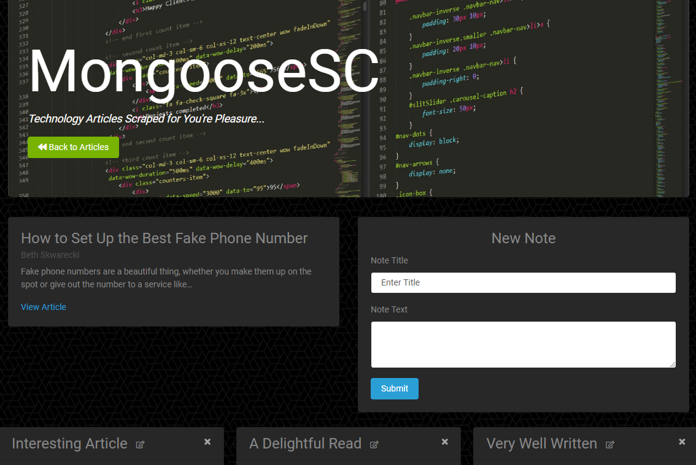

# MongooseSC
##### Web application that allows users to view and comment on the latest news.

MongooseSC is a web application that focuses on bringing the user the latest in tech news.  It utilizes Axios & Cheerio, along with a MongoDB Database with Mongoose to scrape the news articles from other sites on the internet to deliver the latest news and additionally, allows the user to view and comment on the articles.



## Getting Started

These instructions will get you a copy of the project up and running on your local machine for development and testing purposes.  See deployment for notes on how to deploy the project on a live system.

### Prerequisites

In order to install and run MongooseSC on your own device you will need to be able to run MongoDB, in addition to needing the following npm packages:

```
Node.js
Express.js
Express-Handlebars
Mongoose
Cheerio
Axios
```

### Installing

You will need to do the following steps after cloning the repo to your device in order to ensure that it works properly.

To ensure Node.js is running within the package and configure all modules for use:

```
npm install (or npm install -y)
```

This should install all the requisite modules, but just in case, you will need:

```
express             (npm install -s express)
express-handlebars  (npm install -s express-handlebars)
mongoose            (npm install -s mongoose)
cheerio             (npm install -s cheerio)
axios               (npm install -s axios)
body-parser         (npm install -s body-parser)
```

## Running 'MongooseSC'

To run MongooseSC locally you will need to have MongoDB running on your computer, you can then begin the server simply by path into the root folder for the application and running:

```
node server.js (or nodemon server.js)
```

This will start the server running and using Mongoose and the schema's already defined in the 'Models' directory will take care of setting up the collections within the database.  That is really all there is to starting the application running, after that everything else is run in your browser.  (You can edit the name of the collection that is made on your local instance of MongoDB from within the server.js file if you so desire.)

## Deployment

* [Deployed Site](https://mongoose-sc.herokuapp.com/)

I personally have this application deployed using Heroku, with mLab serving serving as the remote MongoDB database.  The steps to deploy in this manner are as follows:

Create a heroku app in your project directory:
```
heroku.create
```
Run
```
heroku addons:create mongolab
```
This will add the free mLab provision to your project, which you can view more of the details about and even view the collections from the dashboard of your Heroku project.

Then run:
```
git push heroku master
```

To deploy your application to Heroku.

## Built With

* [Node.js](https://nodejs.org/en/) - Runtime Environment
* [MongoDB](https://www.mongodb.com/) - Database
* [Mongoose](https://mongoosejs.com/) - MongoDB Object Modeling
* [Handlebars](https://handlebarsjs.com/) - Templating Engine
* [Express.js](https://expressjs.com/) - Web Framework
* [Bootstrap](https://getbootstrap.com/) - CSS Framework
* [gitignore.io](https://www.gitignore.io/) - For creating the .gitignore
* [WebStorm](https://www.jetbrains.com/webstorm/) - JavaScript IDE

## Authors

* **Dalton Ricker** - *Primary Author* - [SasquatchXYZ](https://github.com/SasquatchXYZ)

## Acknowledgments
* Many thanks to my instructors & TAs, as well as the O'Reilly reference books.
